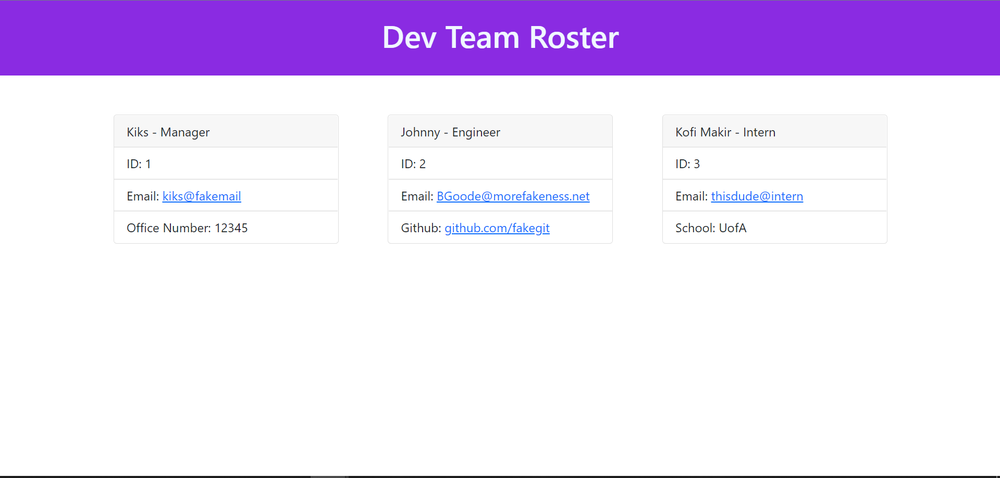

# Development Team Creator
## Description
  
- What was the motivation? To help HR departments create instant pages for their employee teams
- Why did I build this project? To develop ES6 skills using classes and using test driven development
- What problem does it solve? It creates an accessible webpage for contact information
- What did I learn? How to utilize classes, extend, .map, and other functions
  
## Table of Contents (Optional)
  
- [Installation](#installation)
- [Usage](#usage)
- [Credits](#credits)
- [License](#license)
- [Tests](#tests)
- [Questions](#questions)
  
## Installation

.

## Usage
  
Run node index on the console

https://www.youtube.com/watch?v=wAZPqO7Ug98

  

  
## Credits
  
Collaborators: No collaborators 
  
## License
  
Unlicensed

## Tests
  
Run tests using jest on npm
  
## Questions
  
All questions and communications can be directed to:
Github: github.com/frivera14/Development-Team-Creator 
Email: kikridu@gmail.com
